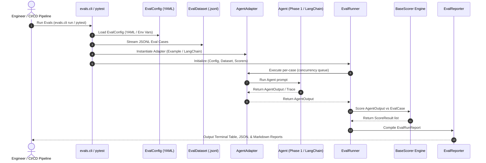
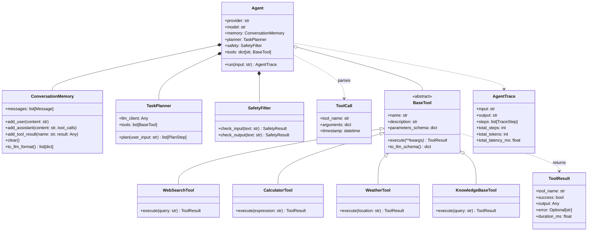
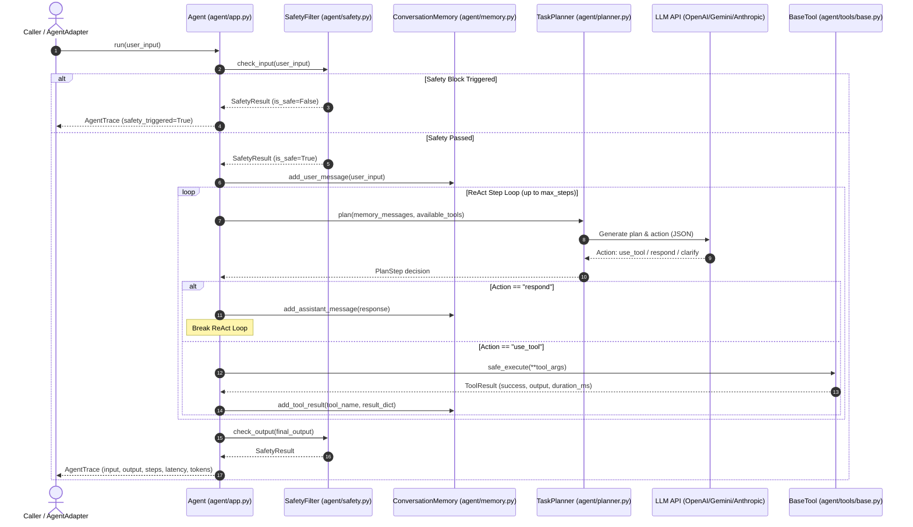
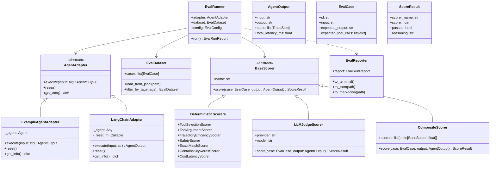
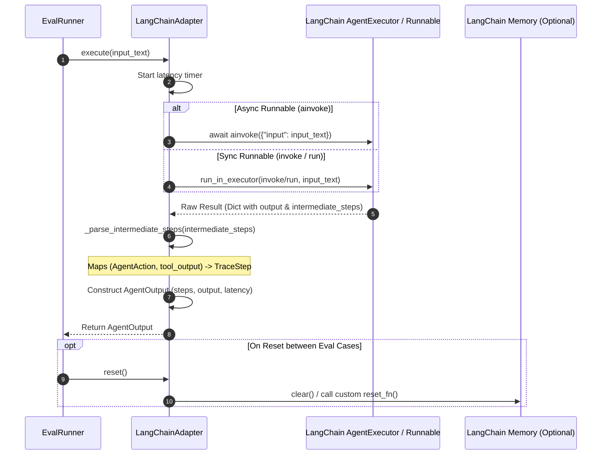
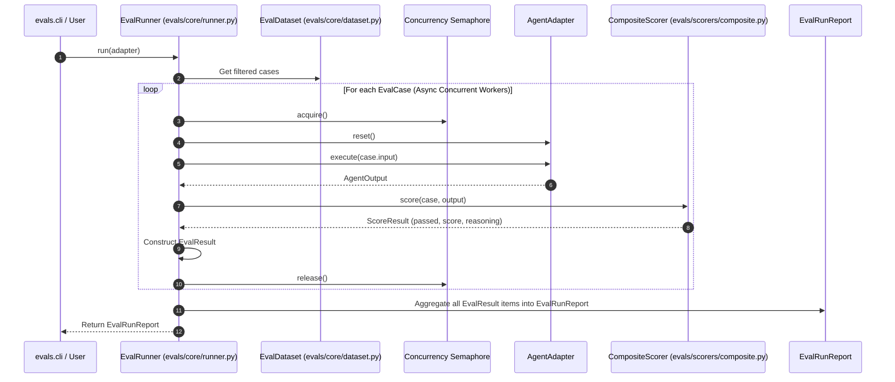
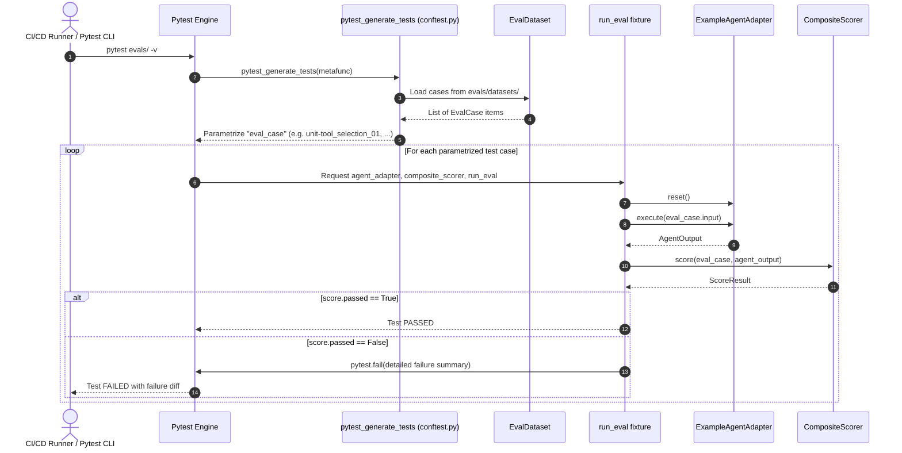
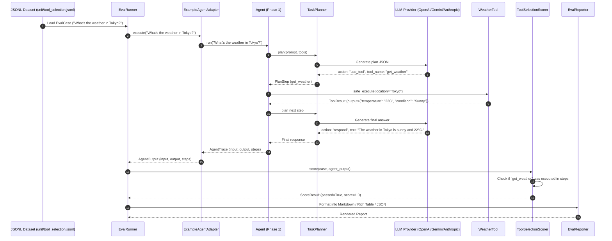

# Step-by-Step Guide to Build an Evals Framework for LLM Agentic Applications

> **Audience**: This document is written for engineers and AI tools. Follow each step sequentially. Do not skip steps. Each step includes the *what*, *why*, and *detailed specifications* for implementation.

---

## 📖 Table of Contents

* [Overview](#overview)
* [Prerequisites](#prerequisites)
* [🐍 Python Primer for Beginners](#-python-primer-for-beginners)
* [PHASE 1: Build the Example Agentic Application](#phase-1-build-the-example-agentic-application)
  * [Phase 1 Architecture & Class Diagram](#phase-1-architecture--class-diagram)
  * [Step 1: Set Up the Project Structure](#step-1-set-up-the-project-structure)
  * [Step 2: Define the Abstract Base Tool](#step-2-define-the-abstract-base-tool)
  * [Step 3: Implement the Four Tools](#step-3-implement-the-four-tools)
    * [3a: Web Search Tool](#3a-web-search-tool-agenttoolsweb_searchpy)
    * [3b: Calculator Tool](#3b-calculator-tool-agenttoolscalculatorpy)
    * [3c: Weather Tool](#3c-weather-tool-agenttoolsweatherpy)
    * [3d: Knowledge Base Tool](#3d-knowledge-base-tool-agenttoolsknowledge_basepy)
  * [Step 4: Build the Conversation Memory Manager](#step-4-build-the-conversation-memory-manager)
  * [Step 5: Build the Task Planner](#step-5-build-the-task-planner)
  * [Step 6: Build the Safety Filter](#step-6-build-the-safety-filter)
  * [Step 7: Build the Main Agent Orchestration Loop](#step-7-build-the-main-agent-orchestration-loop)
  * [Step 8: Build the Agent Configuration](#step-8-build-the-agent-configuration)
  * [Step 9: Add a Simple CLI Entry Point](#step-9-add-a-simple-cli-entry-point)
  * [Step 10: Verify Phase 1](#step-10-verify-phase-1)
* [PHASE 2: Build the Generic Evals Framework](#phase-2-build-the-generic-evals-framework)
  * [Phase 2 Architecture & Class Diagram](#phase-2-architecture--class-diagram)
  * [Step 11: Set Up the Evals Framework Directory Structure](#step-11-set-up-the-evals-framework-directory-structure)
  * [Step 12: Define the Framework's Abstract Interfaces](#step-12-define-the-frameworks-abstract-interfaces)
    * [12a: TraceStep Model](#12a-tracestep-model)
    * [12b: AgentOutput Model](#12b-agentoutput-model)
    * [12c: EvalCase Model](#12c-evalcase-model)
    * [12d: ScoreResult Model](#12d-scoreresult-model)
    * [12e: EvalResult Model](#12e-evalresult-model)
    * [12f: AgentAdapter Abstract Class](#12f-agentadapter-abstract-class)
  * [Step 13a: Build the Agent Adapter for the Example Agent](#step-13a-build-the-agent-adapter-for-the-example-agent)
  * [Step 13b: Build a Generic Adapter for LangChain & Agent Frameworks](#step-13b-build-a-generic-adapter-for-langchain--agent-frameworks)
  * [Step 14: Build the Dataset Loader](#step-14-build-the-dataset-loader)
  * [Step 15: Create the Eval Datasets](#step-15-create-the-eval-datasets)
  * [Step 16: Build the Abstract Scorer Interface](#step-16-build-the-abstract-scorer-interface)
  * [Step 17: Build the Deterministic Scorers](#step-17-build-the-deterministic-scorers)
  * [Step 18: Build the LLM-as-Judge Scorer](#step-18-build-the-llm-as-judge-scorer)
  * [Step 19: Build the Composite Scorer](#step-19-build-the-composite-scorer)
  * [Step 20: Build the Eval Execution Engine](#step-20-build-the-eval-execution-engine)
  * [Step 21: Build the Reporter](#step-21-build-the-reporter)
  * [Step 22: Build the Eval Configuration Files](#step-22-build-the-eval-configuration-files)
  * [Step 23: Build the CLI Entry Point](#step-23-build-the-cli-entry-point)
  * [Step 24: Build the Pytest Integration](#step-24-build-the-pytest-integration)
  * [Step 25: Write Framework Unit Tests](#step-25-write-framework-unit-tests)
  * [Step 26: Verify the Complete System](#step-26-verify-the-complete-system)
  * [Step 27: Final Project Cleanup](#step-27-final-project-cleanup)
* [🗺️ Class & File Path Reference Table](#%EF%B8%8F-class--file-path-reference-table)
* [Summary](#summary)

---

## Overview

This guide walks through two phases:

1. **Phase 1** — Build an example agentic application (a multi-tool research assistant) to serve as the system-under-test.
2. **Phase 2** — Build a generic, reusable evals framework that can evaluate *any* agentic application (including LangChain, CrewAI, AutoGen, or custom agents), and demonstrate it by evaluating the Phase 1 agent and generic framework adapters.

The evals framework is completely decoupled from the example agent. It evaluates any agent that implements the simple `AgentAdapter` contract.

### 🔄 Master System Execution Sequence Diagram

The diagram below illustrates the master lifecycle of the framework — showing how configurations are loaded, datasets are read, adapters bridge prompts to agents, runner engines execute evaluations concurrently, scorers calculate metrics, and reporters generate outputs.



---

## Prerequisites

- Python 3.11+
- An LLM API key (OpenAI, Anthropic, or Google Gemini)
- `uv` or `pip` for dependency management
- No external eval platforms required — this is a self-contained framework

---

## 🐍 Python Primer for Beginners

If you are new to Python, this codebase relies on a few fundamental Python concepts and patterns. Review these key paradigms before diving into the code:

### 1. Object-Oriented Programming (OOP): Classes, Attributes, and `self`
In Python, a **Class** is a blueprint for creating objects. 
- `def __init__(self, ...)` is the constructor method that initializes an instance of a class.
- `self` refers to the specific instance of the object being worked with.

```python
class ResearchAgent:
    def __init__(self, model_name: str):
        self.model_name = model_name  # Instance attribute

    def run(self, prompt: str) -> str:
        return f"Agent running {self.model_name} on: {prompt}"
```

### 2. Abstract Base Classes (`ABC`) and Decoupling
An **Abstract Base Class (ABC)** defines a contract or interface that child classes *must* implement. It cannot be instantiated directly.
- Uses `from abc import ABC, abstractmethod`.
- `@abstractmethod` marks methods that child classes must override.

> [!NOTE]
> **Why this matters for Evals**: ABCs allow the Evals Framework (`evals/core/interfaces.py`) to know **nothing** about how an AI agent is built internally. As long as an agent adapter implements `AgentAdapter`, the framework can evaluate it seamlessly!

```python
from abc import ABC, abstractmethod

class BaseTool(ABC):
    @abstractmethod
    async def execute(self, **kwargs) -> dict:
        """Subclasses MUST implement this method."""
        pass
```

### 3. Pydantic Data Models (`BaseModel`)
[Pydantic](https://docs.pydantic.dev/) is used throughout `agent/` and `evals/` for data validation, type enforcement, and automatic serialization (converting Python objects to/from JSON).

```python
from pydantic import BaseModel, Field
from typing import Optional

class TraceStep(BaseModel):
    step_number: int
    action: str
    tool_name: Optional[str] = None
    reasoning: str = ""
```

Key features of Pydantic:
- **Type Checking**: Ensures fields match their type annotations.
- **Serialization**: Call `.model_dump()` to get a dictionary or `.model_dump_json()` for JSON.
- **Default Factories**: Use `Field(default_factory=list)` for mutable defaults like empty lists.

### 4. Asynchronous Concurrency (`async def` and `await`)
Agent execution and LLM evaluations involve network requests. Python uses `asyncio` to perform non-blocking I/O operations.
- `async def` defines a coroutine function.
- `await` pauses execution until the asynchronous task finishes, allowing other tasks to run concurrently.

```python
import asyncio

async def fetch_llm_response(prompt: str) -> str:
    await asyncio.sleep(0.5)  # Simulates async network request
    return "LLM Response"
```

### 5. Type Hints and Annotations
Type hints make Python code readable and self-documenting:
- `dict[str, Any]`: A dictionary with string keys and values of any type.
- `Optional[str]`: A string value that can also be `None` (equivalent to `str | None`).
- `list[TraceStep]`: A list containing instances of `TraceStep`.

### 6. JSONL (JSON Lines) Streaming
Dataset files (`.jsonl`) store one valid JSON object per line. This format allows streaming large evaluation datasets line-by-line without loading entire files into memory.

### 7. The Significance of `pytest` in Python & AI Evals Frameworks
`pytest` is the industry-standard testing framework in Python. In traditional software development, `pytest` executes unit and integration tests. In **LLM & Agentic Evals**, `pytest` plays a critical role for several reasons:

- **Automated Regression Testing**: LLM prompts, model weights, and agent behaviors can drift or regress over time. `pytest` acts as an automated gatekeeper to ensure prompt edits or model updates do not break tool selection, safety policies, or schema formatting.
- **Continuous Integration (CI/CD)**: Running `pytest` in CI/CD pipelines (e.g., GitHub Actions or GitLab CI) prevents regressions from being merged into production.
- **Async Test Execution (`pytest-asyncio`)**: Agentic workflows involve asynchronous network calls (`async`/`await`). The `@pytest.mark.asyncio` decorator allows testing coroutines without writing event-loop boilerplate.
- **Dynamic Dataset Parametrization**: Using `pytest_generate_tests` (see [evals/conftest.py](evals/conftest.py)), each `.jsonl` evaluation case in a dataset is automatically converted into an individual `pytest` test case with distinct pass/fail status and assertion output.

---

# PHASE 1: Build the Example Agentic Application

The purpose of Phase 1 is to create a realistic agentic app (a multi-tool research assistant) that serves as the system-under-test.

## Phase 1 Architecture & Class Diagram

The Phase 1 agent consists of an orchestration `Agent`, conversation `ConversationMemory`, task `TaskPlanner`, input/output `SafetyFilter`, `BaseTool` hierarchy, and data models (`ToolCall`, `ToolResult`, `AgentTrace`).



### 🔄 Phase 1 Agent Prompt Execution & ReAct Loop Sequence Diagram

This diagram details the exact execution flow when a user prompt enters `Agent.run(user_input)` — from safety screening to multi-step LLM planning, safe tool execution, memory updates, output filtering, and trace generation.



---

## Step 1: Set Up the Project Structure

Create the following directory layout at the project root:

```
evals-framework/
├── agent/                        # Phase 1: Example agentic application
│   ├── __init__.py
│   ├── app.py                    # Main agent orchestration loop
│   ├── config.py                 # LLM provider config, model settings
│   ├── tools/                    # Tool implementations
│   │   ├── __init__.py
│   │   ├── base.py               # Abstract base tool class
│   │   ├── web_search.py         # Web search tool
│   │   ├── calculator.py         # Math calculation tool
│   │   ├── weather.py            # Weather lookup tool
│   │   └── knowledge_base.py     # Local knowledge base search tool
│   ├── memory.py                 # Conversation memory / context management
│   ├── planner.py                # Task decomposition and planning
│   └── safety.py                 # Input/output safety filters
├── evals/                        # Phase 2: Generic evals framework
│   ├── __init__.py
│   ├── adapters/                 # Framework adapters (Example & LangChain)
│   │   ├── __init__.py
│   │   ├── example_agent.py      # Adapter for Phase 1 agent
│   │   └── langchain_adapter.py  # Generic LangChain adapter
│   ├── core/                     # Core engine (interfaces, runner, reporter)
│   ├── datasets/                 # Eval JSONL datasets
│   └── scorers/                  # Rule-based & LLM-as-judge scorers
├── pyproject.toml
└── README.md
```

---

## Step 2: Define the Abstract Base Tool

**File**: [agent/tools/base.py](agent/tools/base.py)

- Define `ToolCall`: `tool_name` (str), `arguments` (dict), `timestamp` (datetime).
- Define `ToolResult`: `tool_name` (str), `success` (bool), `output` (Any), `error` (Optional[str]), `duration_ms` (float).
- Define `BaseTool(ABC)`: Abstract properties (`name`, `description`, `parameters_schema`), abstract `async execute(**kwargs)`, and `to_llm_schema()`.

---

## Step 3: Implement the Four Tools

Build four simulated concrete tools extending `BaseTool`:
- **3a**: Web Search Tool ([agent/tools/web_search.py](agent/tools/web_search.py))
- **3b**: Calculator Tool ([agent/tools/calculator.py](agent/tools/calculator.py))
- **3c**: Weather Tool ([agent/tools/weather.py](agent/tools/weather.py))
- **3d**: Knowledge Base Tool ([agent/tools/knowledge_base.py](agent/tools/knowledge_base.py))

---

## Step 4: Build the Conversation Memory Manager

**File**: [agent/memory.py](agent/memory.py)

- `Message`: model representing `role`, `content`, `tool_calls`, `tool_results`.
- `ConversationMemory`: stores full conversation history, provides `add_user()`, `add_assistant()`, `add_tool_result()`, `clear()`, and `to_llm_format()`.

---

## Step 5: Build the Task Planner

**File**: [agent/planner.py](agent/planner.py)

- `PlanStep`: `step_number` (int), `description` (str), `suggested_tool` (Optional[str]), `status` (str).
- `TaskPlanner`: decomposes complex queries into ordered plan steps.

---

## Step 6: Build the Safety Filter

**File**: [agent/safety.py](agent/safety.py)

- `SafetyFilter`: checks inputs for prompt injection / unsafe topics and checks outputs for PII leaks / unsafe content.

---

## Step 7: Build the Main Agent Orchestration Loop

**File**: [agent/app.py](agent/app.py)

- `Agent`: main orchestration class combining memory, planner, safety filter, and tools into an async ReAct execution loop (`async run(input)` returning an `AgentTrace`).

---

## Step 8: Build the Agent Configuration

**File**: [agent/config.py](agent/config.py)

- `Settings`: manages LLM provider (`openai`, `anthropic`, `google`), model name, and API keys using environment variables.

---

## Step 9: Add a Simple CLI Entry Point

**File**: [agent/cli.py](agent/cli.py)

- Provides interactive CLI and single-query execution for testing the Phase 1 agent.

---

## Step 10: Verify Phase 1

Run the agent on sample queries:
```bash
python -m agent.cli --query "What is the weather in Tokyo?"
```

---

# PHASE 2: Build the Generic Evals Framework

Phase 2 builds an agent-agnostic evaluation framework.

## Phase 2 Architecture & Class Diagram

The Evals Framework relies on `AgentAdapter` to abstract away agent implementations, `EvalRunner` for async execution, `EvalDataset` for dataset loading, and a hierarchy of `BaseScorer` implementations.



---

## Step 11: Set Up the Evals Framework Directory Structure

Create directory layout under `evals/`:
```
evals/
├── adapters/         # Adapters bridging external agents to framework
├── configs/          # YAML configuration files
├── core/             # Framework core (interfaces, dataset, runner, reporter)
├── datasets/         # JSONL test datasets (unit, integration, e2e, regression)
└── scorers/          # Rule-based, LLM-as-judge, and composite scorers
```

---

## Step 12: Define the Framework's Abstract Interfaces

**File**: [evals/core/interfaces.py](evals/core/interfaces.py)

- **12a**: `TraceStep` model (`step_number`, `action`, `tool_name`, `tool_args`, `tool_result`, `reasoning`).
- **12b**: `AgentOutput` model (`input`, `output`, `steps`, `total_steps`, `total_tokens`, `total_latency_ms`).
- **12c**: `EvalCase` model (`id`, `input`, `expected_output`, `expected_tool_calls`, `turns`, `tags`, `difficulty`, `category`).
- **12d**: `ScoreResult` model (`scorer_name`, `score`, `passed`, `threshold`, `reasoning`).
- **12e**: `EvalResult` model (`case_id`, `agent_output`, `scores`, `overall_passed`, `overall_score`).
- **12f**: `AgentAdapter(ABC)` interface (`execute()`, `reset()`, `get_info()`).

---

## Step 13a: Build the Agent Adapter for the Example Agent

**File**: [evals/adapters/example_agent.py](evals/adapters/example_agent.py)

- Implements `AgentAdapter` for the Phase 1 agent, converting `AgentTrace` into `AgentOutput`.

---

## Step 13b: Build a Generic Adapter for LangChain & Agent Frameworks

**File**: [evals/adapters/langchain_adapter.py](evals/adapters/langchain_adapter.py)

To evaluate agents built with frameworks like **LangChain**, **CrewAI**, or **AutoGen**, build a generic adapter. The `LangChainAdapter` wraps any LangChain `AgentExecutor` or `Runnable` and transforms intermediate steps (`(AgentAction, tool_output)`) into framework `TraceStep` objects.

```python
from evals.adapters.langchain_adapter import LangChainAdapter

# Wrap any LangChain AgentExecutor or Runnable
adapter = LangChainAdapter(
    agent=my_langchain_agent_executor,
    name="MyLangChainAssistant",
    reset_fn=lambda: memory.clear()
)

# Pass directly to EvalRunner!
runner = EvalRunner(adapter=adapter, dataset=dataset, config=config)
report = await runner.run()
```

### 🔄 Generic LangChain Adapter Sequence Diagram

This diagram shows how `LangChainAdapter` translates execution requests and intermediate steps between the Evals Framework and a LangChain `AgentExecutor` or `Runnable`:



---

## Step 14: Build the Dataset Loader

**File**: [evals/core/dataset.py](evals/core/dataset.py)

- `EvalDataset`: parses JSONL files into `EvalCase` objects with filtering (`filter_by_tags`, `filter_by_category`, `sample`).

---

## Step 15: Create the Eval Datasets

Create 44+ eval cases in JSONL files across `evals/datasets/`:
- `unit/tool_selection.jsonl`
- `unit/safety.jsonl`
- `integration/multi_tool.jsonl`
- `e2e/full_scenarios.jsonl`
- `regression/golden.jsonl`

---

## Step 16: Build the Abstract Scorer Interface

**File**: [evals/scorers/base.py](evals/scorers/base.py)

- `BaseScorer(ABC)`: defines `async score(case: EvalCase, output: AgentOutput) -> ScoreResult`.

---

## Step 17: Build the Deterministic Scorers

**File**: [evals/scorers/deterministic.py](evals/scorers/deterministic.py)

Implement rule-based scorers:
- `ToolSelectionScorer`
- `ToolArgumentScorer`
- `TrajectoryEfficiencyScorer`
- `SafetyScorer`
- `ExactMatchScorer`
- `ContainsKeywordsScorer`
- `CostLatencyScorer`

---

## Step 18: Build the LLM-as-Judge Scorer

**File**: [evals/scorers/llm_judge.py](evals/scorers/llm_judge.py)

- `LLMJudgeScorer`: evaluates output quality, factual correctness, and reasoning using an LLM evaluator with bias mitigation.
- `GroundednessLLMScorer`: evaluates hallucination against retrieved context.

---

## Step 19: Build the Composite Scorer

**File**: [evals/scorers/composite.py](evals/scorers/composite.py)

- `CompositeScorer`: combines multiple weighted scorers into a single pass/fail evaluation score.

---

## Step 20: Build the Eval Execution Engine

**File**: [evals/core/runner.py](evals/core/runner.py)

- `EvalRunner`: async orchestration engine supporting concurrent execution (`max_concurrency`), timeouts, retries, and dataset filtering.

### 🔄 EvalRunner Execution Engine Sequence Diagram

This diagram shows how `EvalRunner` manages parallel worker execution, resets agent adapters between evaluation cases, executes cases, and scores outputs:



---

## Step 21: Build the Reporter

**File**: [evals/core/reporter.py](evals/core/reporter.py)

- `EvalReporter`: formats evaluation results into Rich terminal tables, JSON summary reports, and Markdown artifacts.

---

## Step 22: Build the Eval Configuration Files

**Files**: `evals/configs/default.yaml`, `evals/configs/full.yaml`

- Defines dataset selection, scorer thresholds, concurrency, and model parameters.

---

## Step 23: Build the CLI Entry Point

**File**: [evals/cli.py](evals/cli.py)

- CLI tool supporting `python -m evals.cli run` and `python -m evals.cli compare`.

---

## Step 24: Build the Pytest Integration

**File**: [evals/conftest.py](evals/conftest.py)

- **Significance & Purpose**: Integrates evaluation cases directly into standard `pytest` workflows. This bridges the gap between ad-hoc evaluation scripts and automated CI/CD quality gates.
- **Key Mechanics**:
  - `agent_adapter` fixture: Instantiates the agent adapter under test.
  - `composite_scorer` fixture: Loads rule-based and LLM-as-judge scoring metrics.
  - `pytest_generate_tests(metafunc)` hook: Dynamically reads all evaluation cases from `.jsonl` files in `evals/datasets/` and parametrizes them as individual `pytest` test cases. Each evaluation case appears as a named test item (e.g., `test_eval[unit-tool_selection_01]`).
  - `run_eval` fixture: Executes the agent on single-turn or multi-turn cases, applies scoring metrics, and raises informative `pytest.fail()` messages with detailed scorer breakdowns if evaluation criteria are not met.

Running evals as unit tests:
```bash
pytest evals/ -v -k "unit"
```

### 🔄 Pytest Integration & Dynamic Test Execution Sequence Diagram

This diagram illustrates how `pytest` dynamically parametrizes JSONL dataset cases into standard unit tests via `pytest_generate_tests` in [evals/conftest.py](evals/conftest.py):



---

## Step 25: Write Framework Unit Tests

**Directory**: [tests/](tests/)

- `test_dataset.py`, `test_runner.py`, `test_scorers.py`, and `test_langchain_adapter.py`.

---

## Step 26: Verify the Complete System

Run pytest to ensure all framework tests pass:
```bash
pytest -v
```

### 🔄 End-to-End Prompt Lifecycle Sequence Diagram (Dataset Prompt → Agent → Scorer → Report)

This detailed trace tracks a single prompt from its raw dataset string in `.jsonl`, through adapter translation, agent planning, tool execution, safety validation, output synthesis, deterministic & LLM judge scoring, to final report rendering:



---

## Step 27: Final Project Cleanup

Clean up unused files, finalize `pyproject.toml`, and update `README.md`.

---

## 🗺️ Class & File Path Reference Table

Below is a complete reference of every class across Phase 1 and Phase 2, its file location, subsystem, and role:

| Class Name | File Path | Phase / Subsystem | Description & Role |
|---|---|---|---|
| `BaseSettings` / `Settings` | [agent/config.py](agent/config.py) | Phase 1 (Config) | Loads environment variables and configures LLM providers & API keys. |
| `ToolCall` | [agent/tools/base.py](agent/tools/base.py) | Phase 1 (Tools) | Pydantic model representing a tool invocation request by the agent. |
| `ToolResult` | [agent/tools/base.py](agent/tools/base.py) | Phase 1 (Tools) | Pydantic model representing the output/error of a tool execution. |
| `BaseTool` | [agent/tools/base.py](agent/tools/base.py) | Phase 1 (Tools) | Abstract base class that all concrete agent tools must implement. |
| `WebSearchTool` | [agent/tools/web_search.py](agent/tools/web_search.py) | Phase 1 (Tools) | Concrete tool simulating web search queries. |
| `CalculatorTool` | [agent/tools/calculator.py](agent/tools/calculator.py) | Phase 1 (Tools) | Concrete tool executing mathematical calculations safely. |
| `WeatherTool` | [agent/tools/weather.py](agent/tools/weather.py) | Phase 1 (Tools) | Concrete tool looking up simulated weather forecasts. |
| `KnowledgeBaseTool` | [agent/tools/knowledge_base.py](agent/tools/knowledge_base.py) | Phase 1 (Tools) | Concrete tool searching internal documentation policies. |
| `Message` | [agent/memory.py](agent/memory.py) | Phase 1 (Memory) | Pydantic model representing a single conversation message in history. |
| `ConversationMemory` | [agent/memory.py](agent/memory.py) | Phase 1 (Memory) | Manages full multi-turn conversation memory and context window. |
| `PlanStep` | [agent/planner.py](agent/planner.py) | Phase 1 (Planner) | Model representing one decomposed step in an agent's execution plan. |
| `TaskPlanner` | [agent/planner.py](agent/planner.py) | Phase 1 (Planner) | Breaks down complex multi-step user prompts into actionable plans. |
| `SafetyFilter` | [agent/safety.py](agent/safety.py) | Phase 1 (Safety) | Filters user input for prompt injection and screens output for PII leaks. |
| `TraceStep` (Agent) | [agent/app.py](agent/app.py) | Phase 1 (Core) | Native execution step record produced by the Phase 1 agent. |
| `AgentTrace` | [agent/app.py](agent/app.py) | Phase 1 (Core) | Complete execution trace returned after running the Phase 1 agent. |
| `Agent` | [agent/app.py](agent/app.py) | Phase 1 (Core) | Main ReAct agent orchestration loop linking tools, memory, and planner. |
| `TraceStep` (Framework) | [evals/core/interfaces.py](evals/core/interfaces.py) | Phase 2 (Interfaces) | Provider-agnostic execution step model used by all framework scorers. |
| `AgentOutput` | [evals/core/interfaces.py](evals/core/interfaces.py) | Phase 2 (Interfaces) | Provider-agnostic summary of an agent's output, steps, cost, and latency. |
| `Turn` | [evals/core/interfaces.py](evals/core/interfaces.py) | Phase 2 (Interfaces) | Represents one interaction turn in multi-turn conversation eval cases. |
| `EvalCase` | [evals/core/interfaces.py](evals/core/interfaces.py) | Phase 2 (Interfaces) | Single test case schema loaded from dataset `.jsonl` files. |
| `ScoreResult` | [evals/core/interfaces.py](evals/core/interfaces.py) | Phase 2 (Interfaces) | Output produced by one scorer for one evaluation case. |
| `EvalResult` | [evals/core/interfaces.py](evals/core/interfaces.py) | Phase 2 (Interfaces) | Full combined evaluation result (output + all scorer scores) for a case. |
| `AgentAdapter` | [evals/core/interfaces.py](evals/core/interfaces.py) | Phase 2 (Interfaces) | Abstract interface contract that any agent framework must implement. |
| `ExampleAgentAdapter` | [evals/adapters/example_agent.py](evals/adapters/example_agent.py) | Phase 2 (Adapters) | Concrete adapter connecting the Phase 1 multi-tool agent to evals. |
| `LangChainAdapter` | [evals/adapters/langchain_adapter.py](evals/adapters/langchain_adapter.py) | Phase 2 (Adapters) | Generic adapter wrapping LangChain `AgentExecutor` or `Runnable` objects. |
| `EvalDataset` | [evals/core/dataset.py](evals/core/dataset.py) | Phase 2 (Core) | Loader and manager for JSONL datasets with filtering and sampling. |
| `BaseScorer` | [evals/scorers/base.py](evals/scorers/base.py) | Phase 2 (Scorers) | Abstract base class for all evaluation metrics and scorers. |
| `ToolSelectionScorer` | [evals/scorers/deterministic.py](evals/scorers/deterministic.py) | Phase 2 (Scorers) | Scores whether the agent selected the expected tools. |
| `ToolArgumentScorer` | [evals/scorers/deterministic.py](evals/scorers/deterministic.py) | Phase 2 (Scorers) | Scores whether tool invocation arguments match expected values. |
| `TrajectoryEfficiencyScorer` | [evals/scorers/deterministic.py](evals/scorers/deterministic.py) | Phase 2 (Scorers) | Penalizes agents that take excessive steps to solve a prompt. |
| `SafetyScorer` | [evals/scorers/deterministic.py](evals/scorers/deterministic.py) | Phase 2 (Scorers) | Scores whether safety blocks were correctly triggered when expected. |
| `ExactMatchScorer` | [evals/scorers/deterministic.py](evals/scorers/deterministic.py) | Phase 2 (Scorers) | Evaluates exact string matches against ground truth outputs. |
| `ContainsKeywordsScorer` | [evals/scorers/deterministic.py](evals/scorers/deterministic.py) | Phase 2 (Scorers) | Verifies required keywords or key phrases exist in final output. |
| `CostLatencyScorer` | [evals/scorers/deterministic.py](evals/scorers/deterministic.py) | Phase 2 (Scorers) | Verifies execution stayed within configured latency and token budgets. |
| `LLMJudgeScorer` | [evals/scorers/llm_judge.py](evals/scorers/llm_judge.py) | Phase 2 (Scorers) | Evaluates output quality using an LLM evaluator with bias mitigation. |
| `GroundednessLLMScorer` | [evals/scorers/llm_judge.py](evals/scorers/llm_judge.py) | Phase 2 (Scorers) | Evaluates hallucination and groundedness against retrieved context. |
| `CompositeScorer` | [evals/scorers/composite.py](evals/scorers/composite.py) | Phase 2 (Scorers) | Combines multiple weighted scorers into a single aggregate score. |
| `EvalConfig` | [evals/core/runner.py](evals/core/runner.py) | Phase 2 (Core) | Pydantic model managing execution settings (concurrency, timeouts). |
| `EvalRunReport` | [evals/core/runner.py](evals/core/runner.py) | Phase 2 (Core) | Summary report of an entire evaluation suite run. |
| `EvalRunner` | [evals/core/runner.py](evals/core/runner.py) | Phase 2 (Core) | Async execution engine executing eval cases against adapters. |
| `EvalReporter` | [evals/core/reporter.py](evals/core/reporter.py) | Phase 2 (Core) | Generates Rich terminal outputs, JSON summaries, and Markdown reports. |

---

## Summary

At the end of this guide, you will have:

- A complete multi-tool research assistant system-under-test (`agent/`).
- An agent-agnostic Evals Framework (`evals/`).
- Framework adapters for custom agents (`ExampleAgentAdapter`) and LangChain agents (`LangChainAdapter`).
- 44+ eval cases across unit, integration, end-to-end, and regression categories.
- Deterministic, LLM-as-judge, and composite scoring metrics.
- Terminal, JSON, and Markdown reporting tools with Pytest integration for CI/CD.
