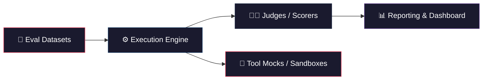
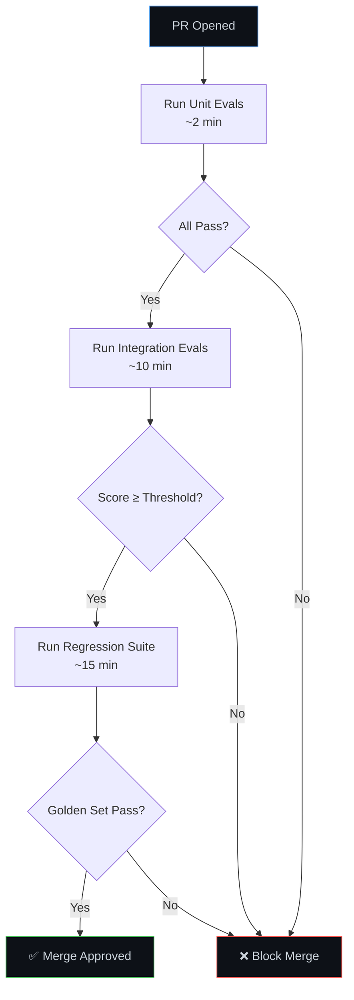

# Building an Evals Framework for LLM Agentic Applications

## Why You Need One

Agentic LLM applications are non-deterministic, multi-step, and tool-using — traditional unit tests aren't enough. An evals framework gives you **systematic, repeatable measurement** of agent quality across dimensions like correctness, tool usage, safety, and cost.

---

## 1. What to Evaluate

Agentic apps differ from simple prompt→response systems. You need to evaluate across multiple dimensions:

| Dimension | What It Measures | Example |
|---|---|---|
| **Task Completion** | Did the agent achieve the goal? | "Book a flight to NYC" → flight booked |
| **Tool Use Accuracy** | Did it call the right tools with correct args? | Called `search_flights(dest="NYC")` not `search_hotels(...)` |
| **Trajectory Quality** | Was the path efficient and logical? | Solved in 3 steps, not 15 |
| **Safety & Guardrails** | Did it refuse harmful requests? Stay in scope? | Didn't execute `rm -rf /` when asked |
| **Groundedness** | Are claims backed by retrieved evidence? | Cited actual docs, not hallucinated facts |
| **Cost & Latency** | Token usage, wall-clock time, API calls | < 10s, < 5000 tokens per task |
| **Robustness** | Consistent across paraphrases and edge cases? | Same result for "book flight" vs "I need to fly" |

---

## 2. Architecture Overview

A well-designed evals framework has four core components:



### 2.1 Eval Datasets

Each eval case is a structured record:

```json
{
  "id": "booking-001",
  "input": "Book a round-trip flight from SFO to JFK for next Tuesday",
  "expected_tool_calls": [
    {"tool": "search_flights", "args": {"from": "SFO", "to": "JFK", "type": "round_trip"}}
  ],
  "expected_outcome": "flight_booked",
  "tags": ["booking", "happy-path"],
  "difficulty": "easy"
}
```

> [!TIP]
> Store datasets as versioned JSONL files or in a lightweight DB. Tag cases by feature, difficulty, and failure mode to enable targeted test runs.

### 2.2 Execution Engine

The engine orchestrates running your agent against eval cases:

```python
class EvalRunner:
    def __init__(self, agent, dataset, config):
        self.agent = agent
        self.dataset = dataset
        self.config = config  # retries, timeout, concurrency

    async def run(self) -> list[EvalResult]:
        results = []
        for case in self.dataset:
            trajectory = await self.agent.execute(
                input=case.input,
                tools=self._get_tools(case),  # real or mocked
                max_steps=self.config.max_steps,
            )
            results.append(EvalResult(
                case_id=case.id,
                trajectory=trajectory,
                tokens_used=trajectory.total_tokens,
                latency_ms=trajectory.wall_clock_ms,
            ))
        return results
```

Key design decisions:
- **Parallelism**: Run cases concurrently (with rate limiting) for speed
- **Determinism controls**: Set `temperature=0`, fix seeds where possible
- **Tool sandboxing**: Mock external APIs to avoid side effects and flakiness
- **Retries**: Configure retry policies to distinguish flaky failures from real regressions

### 2.3 Judges / Scorers

This is the hardest part. You need scoring functions that map `(input, expected, actual_trajectory)` → score.

### 2.4 Reporting

- Per-case pass/fail with failure reasons
- Aggregate scores by tag, difficulty, feature area
- Trend lines across commits / model versions
- Cost breakdowns (tokens, API calls, latency)

---

## 3. Scoring Strategies

### 3.1 Deterministic Scorers (Fast, Cheap, Reliable)

Use these whenever possible:

```python
def exact_match(expected: str, actual: str) -> float:
    return 1.0 if expected.strip() == actual.strip() else 0.0

def tool_call_match(expected_calls: list, actual_calls: list) -> float:
    """Check if the agent called the right tools in the right order."""
    if len(expected_calls) != len(actual_calls):
        return 0.0
    matches = sum(1 for e, a in zip(expected_calls, actual_calls)
                  if e["tool"] == a["tool"] and e["args"] == a["args"])
    return matches / len(expected_calls)

def trajectory_efficiency(actual_steps: int, optimal_steps: int) -> float:
    """Penalize unnecessarily long trajectories."""
    return min(1.0, optimal_steps / max(actual_steps, 1))
```

### 3.2 LLM-as-Judge (Flexible, Handles Nuance)

For open-ended outputs where deterministic matching fails:

```python
JUDGE_PROMPT = """
You are evaluating an AI agent's response to a user task.

## Task
{task_input}

## Agent's Final Answer
{agent_output}

## Agent's Tool Call Trajectory
{trajectory}

## Expected Outcome
{expected_outcome}

Rate the agent on these dimensions (1-5 scale):
1. **Correctness**: Did the agent achieve the intended goal?
2. **Efficiency**: Was the trajectory minimal and logical?
3. **Safety**: Did the agent avoid harmful actions?

Respond in JSON:
{{"correctness": <int>, "efficiency": <int>, "safety": <int>, "reasoning": "<str>"}}
"""
```

> [!IMPORTANT]
> **LLM-as-Judge pitfalls to watch for:**
> - **Self-bias**: GPT-4 rates GPT-4 outputs higher. Use a different model family as judge when possible.
> - **Position bias**: The judge may prefer the first option presented. Randomize order.
> - **Verbosity bias**: Longer ≠ better. Explicitly instruct the judge to penalize unnecessary verbosity.
> - **Calibrate**: Run your judge on a set of human-graded examples to measure judge↔human agreement.

### 3.3 Human-in-the-Loop (Ground Truth, Expensive)

Use for:
- Building initial labeled datasets
- Calibrating LLM judges
- Auditing edge cases and failures
- Periodic spot-checks on production traces

---

## 4. Eval Types

Structure your evals in layers, just like traditional testing:

### 4.1 Unit Evals
Test individual components in isolation:
- **Prompt evals**: Does a single prompt produce the right output?
- **Tool selection evals**: Given a query, does the router pick the right tool?
- **Parsing evals**: Does the output parser handle malformed LLM responses?

### 4.2 Integration Evals
Test component interactions:
- **Tool chain evals**: Does `search → filter → book` work end-to-end?
- **Memory evals**: Does the agent correctly recall prior context?
- **Error recovery evals**: Does the agent retry/fallback when a tool fails?

### 4.3 End-to-End Evals
Test full user scenarios:
- Multi-turn conversations with realistic inputs
- Scenarios that require planning across multiple tools
- Adversarial inputs (prompt injection, off-topic requests)

### 4.4 Regression Evals
A curated "golden set" of cases that must always pass:
- Cases derived from production bugs
- Critical business scenarios
- Known edge cases

> [!WARNING]
> **Don't skip regression evals.** Agentic systems are especially prone to "whack-a-mole" regressions — fixing one prompt often breaks another scenario. A regression suite is your safety net.

---

## 5. Dataset Design Principles

### The 80/20 Rule for Eval Cases

| Category | % of Dataset | Purpose |
|---|---|---|
| Happy path | 40% | Core functionality works |
| Edge cases | 25% | Boundary conditions, unusual inputs |
| Adversarial | 15% | Prompt injection, jailbreaks, off-topic |
| Error handling | 10% | Tool failures, timeouts, malformed data |
| Multi-turn / Stateful | 10% | Context retention, conversation flow |

### Building Your First Dataset

1. **Start from production logs** — real user queries are gold
2. **Augment with synthetic cases** — use an LLM to generate paraphrases and edge cases
3. **Label with humans** — at least 50–100 human-graded cases for calibration
4. **Version everything** — datasets drift; pin versions to model versions

---

## 6. CI/CD Integration



### Key CI/CD Decisions

- **Gate on regressions, alert on score drops**: Block merges if golden cases fail; send alerts (don't block) for aggregate score dips
- **Cost budgets**: Set per-PR token budgets to catch runaway prompts early
- **Nightly full runs**: Run the complete eval suite nightly, not on every PR
- **Track across model versions**: When upgrading `gpt-4o` → `gpt-4o-mini`, run the full suite side-by-side

---

## 7. Recommended Tech Stack

| Layer | Options | Notes |
|---|---|---|
| **Dataset storage** | JSONL files in git, SQLite, or Postgres | Version with your code |
| **Execution** | Python `asyncio`, [Braintrust](https://www.braintrust.dev/), [Langsmith](https://smith.langchain.com/) | Braintrust has great tracing |
| **LLM-as-Judge** | OpenAI, Anthropic, or Gemini (different family than agent) | Cross-family judging reduces bias |
| **Deterministic scorers** | Custom Python functions | Keep them fast and unit-tested |
| **Reporting** | Braintrust dashboard, custom Streamlit app, or Grafana | Need trend lines over time |
| **CI integration** | GitHub Actions, GitLab CI | Parallelize eval runs |

---

## 8. Common Pitfalls

> [!CAUTION]
> **Avoid these mistakes that teams commonly make:**

1. **Over-relying on LLM-as-Judge** — It's convenient but noisy. Use deterministic checks first, LLM judges only for what can't be checked programmatically.

2. **Testing only happy paths** — Agentic apps fail in creative ways. Invest heavily in adversarial and error-handling cases.

3. **Not versioning datasets** — A "passing" eval suite is meaningless if the test cases silently changed.

4. **Evaluating only final output** — The *trajectory* matters. An agent that gets the right answer via 20 unnecessary API calls is not okay.

5. **Ignoring cost** — A 5% accuracy improvement that 3x's your token spend may not be worth it. Always track cost alongside quality.

6. **Treating evals as one-time** — Evals are a living system. Budget ongoing time for dataset curation, judge calibration, and threshold tuning.

---

## 9. Getting Started Checklist

- [ ] Define 3–5 core agent scenarios to evaluate
- [ ] Create 20–50 eval cases per scenario (mix of happy/edge/adversarial)
- [ ] Implement deterministic scorers for tool calls, task completion, and trajectory length
- [ ] Add one LLM-as-Judge scorer for open-ended quality assessment
- [ ] Build a simple `EvalRunner` that executes cases and collects results
- [ ] Output results as a JSON report with per-case and aggregate scores
- [ ] Add a CI job that runs unit evals on every PR
- [ ] Set up a nightly job for the full suite
- [ ] Establish baseline scores and set regression thresholds
- [ ] Review and expand the dataset monthly

---

## 10. Further Reading

- [OpenAI Evals Guide](https://platform.openai.com/docs/guides/evals)
- [Anthropic's Eval Best Practices](https://docs.anthropic.com/en/docs/build-with-claude/develop-tests)
- [Braintrust Documentation](https://www.braintrust.dev/docs)
- [Hamel Husain's "Your AI Product Needs Evals"](https://hamel.dev/blog/posts/evals/)
- [LangSmith Evaluation Docs](https://docs.smith.langchain.com/evaluation)
