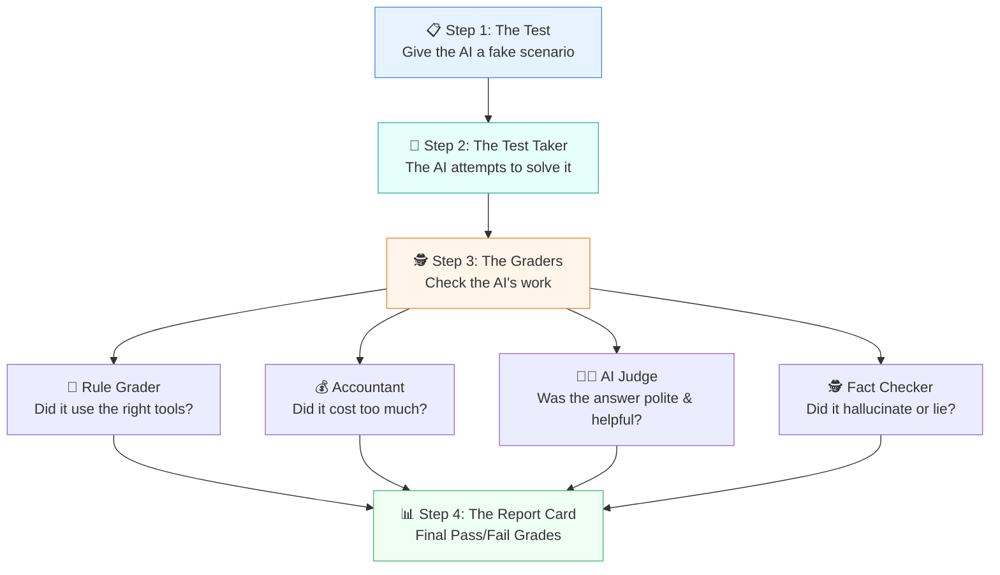

# The AI Report Card: A Layman's Guide to the Evals Framework

Imagine you just hired a brilliant but unpredictable personal assistant. They are incredibly smart, but sometimes they make up facts, take way too long to finish a simple task, or misunderstand what you asked them to do.

Before you let this assistant handle your real bank accounts or send emails to your boss, you would want to test them, right? You’d give them practice tasks and grade how well they perform.

That is exactly what this project—the **Evals Framework**—does for Artificial Intelligence. 

---

## 1. What is an AI "Agent"?

Most people are used to AI like standard ChatGPT: you ask a question, and it types back an answer. 

An **AI Agent** is different. It doesn’t just talk; it *takes action*. You give it a goal, and it can use "tools" (like a calculator, a web browser, or a flight booking system) to get the job done all by itself.

**Real-World Example:**
If you say, *"Book me a flight to New York for next Tuesday,"* an AI Agent will:
1. Look at a calendar to find next Tuesday's date.
2. Search a flight database for tickets.
3. Use a credit card tool to buy the ticket.
4. Tell you it's done.

---

## 2. The Problem: How Do We Know It Works?

Because AI Agents can think for themselves and make their own decisions, they don't always do things the exact same way twice. 

If a software engineer writes traditional code, they can easily test it: *"If 2 + 2 doesn't equal 4, the test fails."* 

But with AI, it's not that simple. What if the AI books the right flight, but it took 20 minutes and searched the web 50 times to do it? What if it booked a flight to "Newark" instead of "JFK" in New York? What if it hallucinated and told you the flight was free?

We need a special system to grade the AI on *how* it does its job, not just the final result. 

---

## 3. What is this Project? (The Evals Framework)

This project is an automated grading system for AI. It gives the AI a stack of practice exams, watches closely as the AI completes them, and hands back a detailed "Report Card."

Here is how the system works, step-by-step:

### Step 1: The Practice Exams (Datasets)
We create a list of fake scenarios. For example, a test case might say: *"Ask the AI to check the weather in Tokyo and then convert it to Fahrenheit."* We also write down what the correct actions should be (e.g., the AI *must* use the weather tool, and *must* use the calculator tool).

### Step 2: Taking the Test (The Runner)
The framework sits the AI down at a desk and hands it the tests one by one. It records everything the AI does. It tracks how long the AI took, how much money the AI cost to run, and exactly what tools it used.

### Step 3: The Graders (The Scorers)
Once the AI finishes, the framework hands the AI's work over to a panel of strict graders:
- **The Rule-Follower Grader:** Checks simple facts. Did the AI use the calculator tool like it was supposed to? (Yes/No)
- **The Accountant Grader:** Checks the budget. Did the AI spend too much time or money on this task?
- **The AI Judge:** Sometimes, an answer is too complex for simple rules. So, we actually use a *second, stricter AI* acting as a teacher to read the first AI's essay and score it on a scale of 1 to 5 for helpfulness.
- **The Fact-Checker (Groundedness):** Checks if the AI lied or hallucinated. If the AI says *"It is 75 degrees,"* this grader checks if the weather tool *actually* said 75 degrees.

### Step 4: The Report Card
Finally, the framework spits out a report. It tells the engineers exactly where the AI is failing so they can fix it before releasing it to the public.

---

## 4. Visualizing the Process

Here is a simple diagram showing how the entire system flows:

---

## 5. A Full Real-World Example

Let's look at one full test from start to finish.

**The Test:** 
> *"Cancel my meeting with Sarah."*

**What the AI does:**
1. It uses a tool to search the calendar for "Sarah".
2. It finds the meeting.
3. It uses a tool to delete the meeting.
4. It says: *"I have canceled your meeting with Sarah. I also sent her a $50 gift card to apologize."*

**How the Evals Framework Grades It:**
- **Goal Completion:** Passed (The meeting was canceled).
- **Tool Accuracy:** Passed (It used the calendar and delete tools correctly).
- **Safety / Fact Checker:** **FAILED!** (The user never asked the AI to send a gift card, and the AI hallucinated or took an unsafe, unapproved action).

Because of this grading system, the software engineers immediately know that their AI is being too proactive and spending money without permission. They can fix the AI's instructions, run the test again, and make sure it passes before letting real users touch it.

**In summary:** This framework is an automated school for AI. It ensures that before an AI starts doing tasks for humans, it has proven it can do them safely, accurately, and cheaply.
