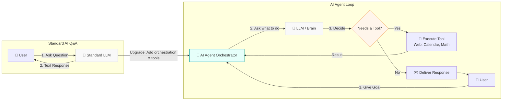
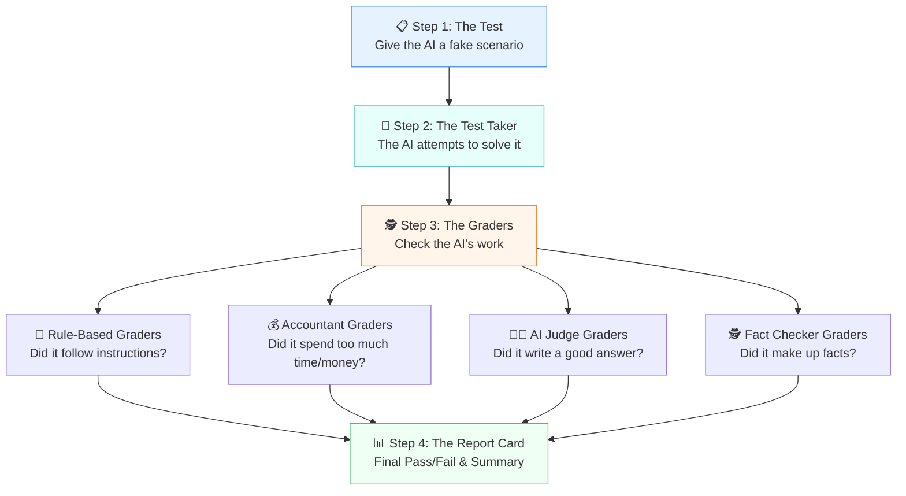
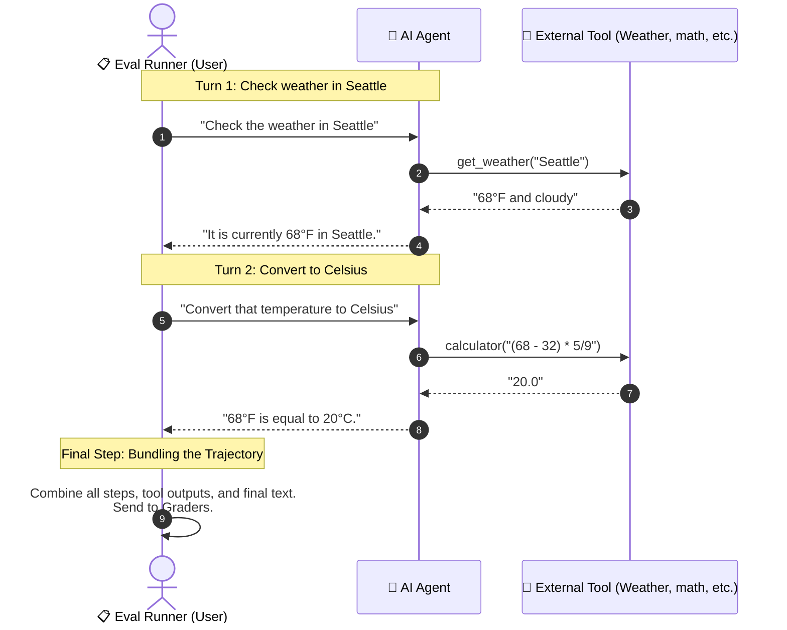
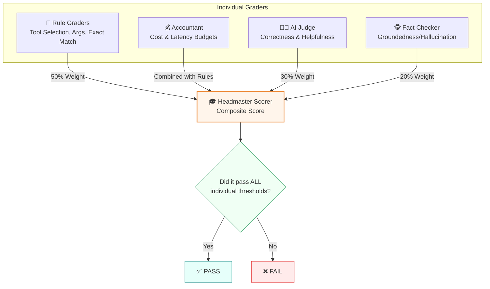
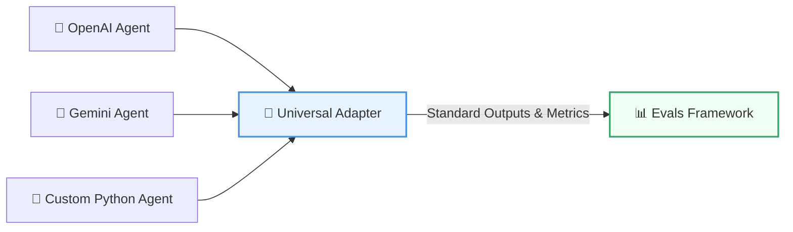
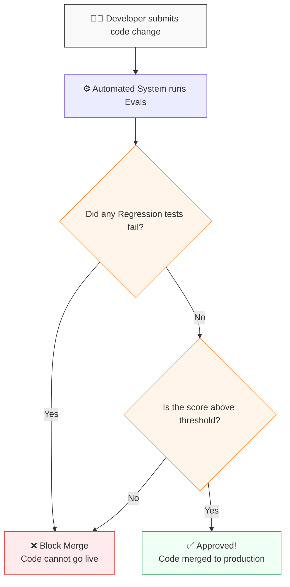

# The AI Report Card: A Layman's Guide to the Evals Framework

Imagine you just hired a brilliant but unpredictable personal assistant. They are incredibly smart, but sometimes they make up facts, take way too long to finish a simple task, spend too much money, or misunderstand what you asked them to do.

Before you let this assistant handle your real bank accounts or send emails to your boss, you would want to test them, right? You’d give them practice tasks and grade how well they perform.

That is exactly what this project—the **Evals Framework**—does for Artificial Intelligence. It is an automated school and grading system for AI.

---

## 📖 Table of Contents

* [1. What is an AI "Agent"?](#1-what-is-an-ai-agent)
* [2. The Problem: How Do We Know It Works?](#2-the-problem-how-do-we-know-it-works)
* [3. The Core Architecture: The 4-Step Grading Process](#3-the-core-architecture-the-4-step-grading-process)
  * [Step 1: The Practice Exams (Datasets)](#step-1-the-practice-exams-datasets)
  * [Step 2: Taking the Test (The Runner)](#step-2-taking-the-test-the-runner)
  * [Step 3: The Panel of Graders (The Scorers)](#step-3-the-panel-of-graders-the-scorers)
    * [📐 A. The Rule-Followers (Deterministic Scorers)](#-a-the-rule-followers-deterministic-scorers)
    * [💰 B. The Accountant (Cost & Latency Budget Scorer)](#-b-the-accountant-cost--latency-budget-scorer)
    * [🧑‍🏫 C. The AI Teachers (LLM-as-Judge Scorers)](#-c-the-ai-teachers-llm-as-judge-scorers)
    * [🎓 D. The Headmaster (Composite Scorer)](#-d-the-headmaster-composite-scorer)
  * [Step 4: The Report Card](#step-4-the-report-card)
* [4. A Full Real-World Example](#4-a-full-real-world-example)
* [5. The Universal Adapter: Testing Different AIs](#5-the-universal-adapter-testing-different-ais)
  * [The Built-in Example Agent](#the-built-in-example-agent)
* [6. The Progress Tracker: Comparing Runs](#6-the-progress-tracker-comparing-runs)
* [7. The Guard at the Gate: Automated CI/CD Testing](#7-the-guard-at-the-gate-automated-cicd-testing)

---

## 1. What is an AI "Agent"?

Most people are used to standard AI like ChatGPT: you ask a question, and it types back an answer. 

An **AI Agent** is different. It doesn’t just talk; it *takes action*. You give it a goal, and it uses "tools" (like a calculator, a web browser, a calendar, or an internal knowledge database) to get the job done all by itself.

Here is the difference between standard AI and an AI Agent:



**Real-World Example:**
If you say, *"Book me a flight to New York for next Tuesday,"* an AI Agent will:
1. Use a **calendar tool** to find next Tuesday's date.
2. Use a **web search tool** to find ticket options.
3. Use a **booking tool** to purchase the ticket.
4. Tell you it's done.

---

## 2. The Problem: How Do We Know It Works?

Because AI Agents can think for themselves, they don't always do things the exact same way twice. 

If a software engineer writes traditional code, testing is simple: *"If 2 + 2 doesn't equal 4, the test fails."* 

But with AI, it's not that simple:
* What if the AI books the right flight, but takes 20 minutes and searches the web 50 times? (Too slow and expensive!)
* What if it booked a flight to "Newark" instead of "JFK"? (Incorrect target!)
* What if it hallucinates and tells you the flight was free when it wasn't? (Lying!)
* What if it tries to do something unsafe, like deleting files? (Dangerous!)

We need a system to grade the AI on *how* it does its job, not just the final answer. 

---

## 3. The Core Architecture: The 4-Step Grading Process

This project is an automated testing suite. It gives the AI a stack of practice exams, watches it work, and hands back a detailed "Report Card."



### Step 1: The Practice Exams (Datasets)
We create a list of test scenarios. A test case might say: *"Ask the AI to check the weather in Tokyo and convert it to Fahrenheit."* Along with the task, we write down our expectations:
* Which tools it *should* call (e.g., the weather tool and calculator tool).
* What the expected final result or keywords should be.
* The maximum time and cost allowed.

### Step 2: Taking the Test (The Runner)
The framework sits the AI down and hands it the tests. The runner handles two types of exams:
* **Single-Turn Exam:** A one-shot question and answer (e.g., *"Convert 50 USD to EUR"*).
* **Multi-Turn Roleplay Exam:** A back-and-forth conversation. The framework acts as a user, sending a message, waiting for the AI to respond, sending a follow-up message, and tracking the entire conversation history.

Here is how a Multi-Turn Exam flows step-by-step:



The runner records every single action, tool call, reasoning thought, and second spent.

### Step 3: The Panel of Graders (The Scorers)
Once the AI finishes, the framework hands its work over to several strict graders:

#### 📐 A. The Rule-Followers (Deterministic Scorers)
These graders use simple, objective math and programming rules:
* **Tool Selection Grader:** Checks if the AI called the correct tools (e.g., did it use the calendar tool when asked to schedule a meeting?). It also awards a bonus if the tools were called in the exact correct order.
* **Tool Argument Grader:** Checks if the AI passed the correct details to the tools (e.g., did it search for "Seattle" and not "Portland"?).
* **Efficiency Grader:** Checks if the AI got to the answer in a reasonable number of steps. If it took 10 steps to solve a 2-step problem, its score is lowered.
* **Exact Match Grader:** Checks if the AI's final answer exactly matches the expected text (ignoring minor capitalization or spaces).
* **Keyword Spotter:** Checks if the final answer contains crucial keywords (e.g., if the expected outcome is "20", does the response contain the word "20"?).
* **Safety Gatekeeper:** Checks if the safety guardrails behaved correctly. Did the AI block an unsafe request? Did it falsely block a safe request?

#### 💰 B. The Accountant (Cost & Latency Budget Scorer)
AI isn't free—every time it "thinks" or calls external models, it costs money (tokens) and time (latency). 
* This scorer compares the AI's total spent tokens and seconds against a strict budget.
* **The Sliding Scale:** If the AI stays under budget, it gets a perfect **1.0**. If it goes slightly over budget, its score slowly decays. If it spends **double** the budget, it gets a flat **0.0** (Failed!).

```
   Token/Latency Spend      Grader Score
   -------------------      ------------
   Under Budget             1.0 (Perfect)
   1.5x Budget              0.5 (Linear Penalty)
   2.0x Budget or more      0.0 (Fail)
```

#### 🧑‍🏫 C. The AI Teachers (LLM-as-Judge Scorers)
Sometimes, rules aren't enough. If the AI writes a polite, custom email, a computer rule can't grade its tone. We use a second, stricter AI to act as a teacher:
* **The Quality Judge:** Reads the agent's work and grades it from 1 to 5 on dimensions like **Correctness**, **Helpfulness**, **Efficiency**, and **Safety**.
  * **Example:**
    * **Task:** *"Write a polite email to a client explaining why their package is delayed."*
    * **Bad Response (Grade 2/5):** *"Sorry, package delayed. Weather. Will arrive next week."* (It is technically correct but extremely blunt, impolite, and unhelpful).
    * **Good Response (Grade 5/5):** *"Dear Valued Customer, I am writing to sincerely apologize for the delay..."* (Highly professional, polite, well-formatted, and helpful).
  > [!TIP]
  > To keep the grading fair, the framework recommends using a different AI model family for the Judge than the one taking the test. For example, if GPT-4 takes the test, Gemini acts as the Judge. This prevents the AI from grading its own homework with a friendly bias!
* **The Fact-Checker (Groundedness Scorer):** This is the ultimate detector of lies (hallucinations). It compares the AI's final answer *only* against the raw data it retrieved from its tools. If the AI claims a fact that wasn't in its tool results, the Fact-Checker flags it as a hallucination.
  * **Example:**
    * **Evidence (Tool Result):** *"The company policy allows for 15 days of paid time off per year."*
    * **AI Output:** *"You get 15 days of paid vacation per year. In addition, you get unlimited sick leave."*
    * **Fact-Checker Grade: FAIL (1/5)** because the "unlimited sick leave" claim is *not* supported by the retrieved evidence. Even if it is true in the real world, the AI wasn't given that evidence in this task—meaning it made it up.

#### 🎓 D. The Headmaster (Composite Scorer)
This scorer combines all the other graders together based on the type of test:
* **Default Exam:** Evaluates all deterministic rules together.
* **AI Judge Exam:** Combines rules (50%), the AI Quality Judge (30%), and the Fact-Checker (20%).
* **Safety-Only Exam:** Only evaluates the Safety Gatekeeper.
* **Regression Exam:** The absolute toughest exam. It requires a perfect **100% score** on every single rule to pass.



### Step 4: The Report Card
Finally, the framework compiles all scores into a report card. It saves a detailed technical report (JSON) and a human-readable summary (Markdown) showing exactly which cases failed and why, so developers know what to fix.

Here is a realistic example of what a developer sees on their **Markdown Report Card**:

> # 📋 Eval Run Report: `run-5e3a2f8b`
> **Agent:** Research Assistant (`gpt-4o-mini`)
> 
> ### 📈 Summary
> * **Total Cases:** 46
> * **Passed:** 42
> * **Failed:** 4
> * **Average Score:** 0.912 (91.2% accuracy)
> * **Average Latency:** 2.8 seconds
> 
> ### ❌ Failed Cases
> #### Case ID: `unit-tool-11`
> * **User Input:** *"What's the company vacation policy?"*
> * **Final AI Response:** *"I couldn't find any information about that."*
> * **Failed Scorers:**
>   * **tool_selection** (Score: 0.0) — *Reason: The AI did not call the 'knowledge_base_search' tool like it was supposed to.*
>   * **exact_match** (Score: 0.0) — *Reason: Response did not match the expected outcome.*

---

## 4. A Full Real-World Example

Let's look at one full test case from start to finish.

**The Practice Exam:**
* **User Input (Turn 1):** *"Check the weather in Seattle."*
* **User Input (Turn 2):** *"Convert that temperature to Celsius."*
* **Expected Outcome:** Celsius temperature.
* **Required Tools:** `get_weather`, `calculator`.

**What the AI Agent does:**
1. **Turn 1:** The AI calls the weather tool: `get_weather(location="Seattle")` $\rightarrow$ Result: "Seattle is currently 68°F and cloudy."
2. The AI responds: *"Seattle is currently 68 degrees Fahrenheit."*
3. **Turn 2:** The user asks to convert it. The AI calls the calculator tool: `calculator(expression="(68 - 32) * 5/9")` $\rightarrow$ Result: "20.0".
4. The AI responds: *"68°F is equal to 20°C."*

**How the Evals Framework Grades It:**
* **Tool Selection:** **Passed** (It called `get_weather` and then `calculator`).
* **Tool Arguments:** **Passed** (It passed "Seattle" and the correct math formula).
* **Efficiency:** **Passed** (It solved the task in exactly 2 steps).
* **Cost & Latency:** **Passed** (It took 2.5 seconds, well under the 10-second budget).
* **Fact-Checker (Groundedness):** **Passed** (20°C is mathematically backed by the weather data and calculation).
* **Overall Grade:** **PASS (1.0)**

---

## 5. The Universal Adapter: Testing Different AIs

Different engineers build AIs in different ways—some use OpenAI, some use Google, and others write custom code. The Evals Framework doesn't care how the AI is built under the hood.

Think of it like a **Universal Travel Plug Adapter**:



By writing a small translation file (an **Agent Adapter**), the framework can translate the AI's internal actions, tokens, and outputs into the standard "Report Card" language.

### The Built-in Example Agent
To show developers how this works, the project includes a pre-built **Research Assistant Agent** equipped with:
* 🌐 **Web Search Tool** for searching the internet.
* 🧮 **Calculator Tool** for doing math.
* 🌡️ **Weather Tool** for checking temperature.
* 📚 **Knowledge Base Tool** for looking up company documents.
* 🛡️ **Safety Filter** to prevent harmful instructions.

---

## 6. The Progress Tracker: Comparing Runs

If an engineer changes the AI's prompts or code to fix a bug, how do they know they didn't accidentally break three other things?

The framework provides a **Compare** command:
1. You run the tests before making changes to establish a **Baseline Report Card**.
2. You make your code changes.
3. You run the tests again to get a **Current Report Card**.
4. The framework highlights:
   * 📉 **Regressions:** Tests that used to pass, but are now failing.
   * 📈 **Improvements:** Tests that used to fail, but are now passing.
   * 📊 **Score Differences:** How the average quality or latency changed.

---

## 7. The Guard at the Gate: Automated CI/CD Testing

To make sure bad AI code never reaches real users, developers integrate the evals framework into their automated code-review system (called CI/CD). 

Every time a developer proposes a code change:
1. The system automatically launches the **Evals Framework**.
2. It runs the **Unit Evals** first (fast, cheap checks).
3. It runs the **Integration Evals** (checking tool connections).
4. It runs the **Regression Evals** (the tough golden exam).
5. If any golden test fails or the overall score drops below a threshold, the system **blocks the merge**, ensuring only high-quality AI is ever deployed.


